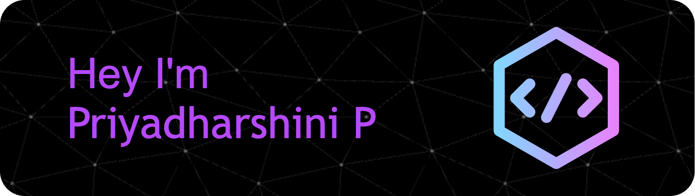

 

 

A passionate fourth-year undergraduate from Velammal Engineering College. Driven by my love for AI/ML, I aim to revolutionize the future through groundbreaking advancements. With a thirst for knowledge, I strive to push boundaries, solve complex problems, and contribute to cutting-edge innovations. Join me on this exhilarating journey to create a brighter, more innovative future using AI/ML. Together, let's make a difference!

 

<h2 align="center" style="font-weight: bold; font-size:24px">My Skills</h2>
 

<h2 align="center" style="font-weight: bold; font-size:24px">My Github Stats</h2>

&nbsp;

<h3 align="center" style="font-weight: bold; font-size:24px">Check out my portfolio @</h3>

 
 

<h3 align="center" style="font-weight: bold; font-size:24px">Connect with me:</h3>

